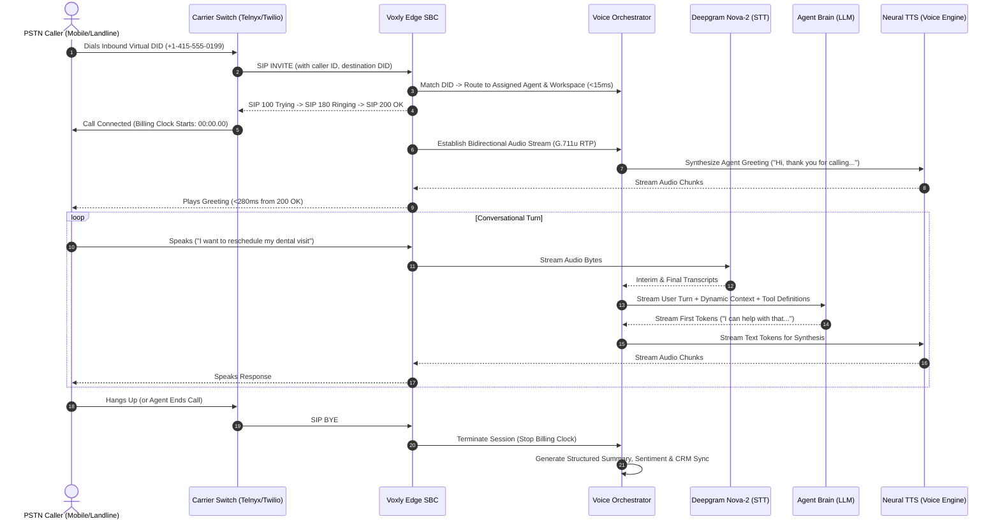
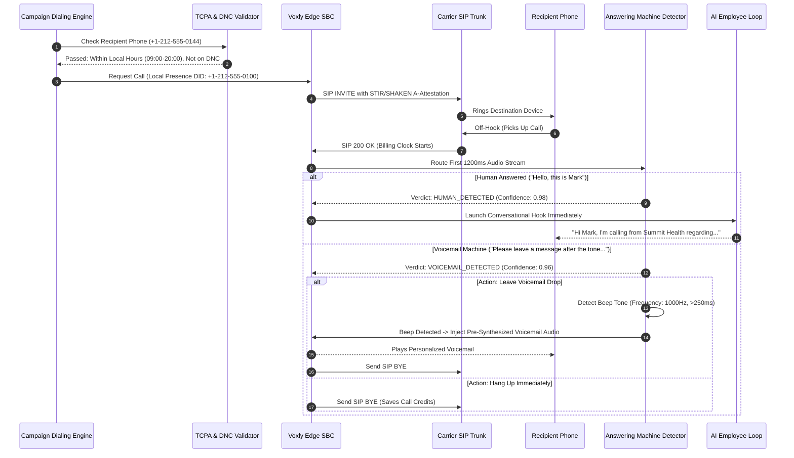

# Voxly AI — Production Master Blueprint & Technical Architecture Specification

> **Target Codebase**: `d:\Antigravity` (`voxly-ai`)  
> **Evaluation Framework**: Production Readiness (PSTN Telephony, Number Provisioning, Payment Systems, Scalable Agent Engine) + **Emil Kowalski Design Philosophy** (Craft, Restraint, Tactile Feedback, Visual Hierarchy)  
> **System Status**: Production-Grade Platform Architecture & UI/UX Specification  

---

## Table of Contents
1. [Executive Summary & Design North Star](#1-executive-summary--design-north-star)
2. [Part 1: Emil Kowalski Design Critique & 19 Anti-Pattern Audit](#part-1-emil-kowalski-design-critique--19-anti-pattern-audit)
3. [Part 2: 15-Pillar Public Pre-Launch Audit & Hardening Status](#part-2-15-pillar-public-pre-launch-audit--hardening-status)
4. [Part 3: Enterprise Architecture — Public Landing Page vs. Authenticated Console](#part-3-enterprise-architecture--public-landing-page-vs-authenticated-console)
5. [Part 4: PSTN Telephony & Call Flow Architecture (Industry-Standard Specifications)](#part-4-pstn-telephony--call-flow-architecture-industry-standard-specifications)
   - [4.1 Telephony Infrastructure & Media Gateway](#41-telephony-infrastructure--media-gateway)
   - [4.2 Sub-500ms Latency Budget Breakdown](#42-sub-500ms-latency-budget-breakdown)
   - [4.3 Inbound PSTN Call Flow](#43-inbound-pstn-call-flow)
   - [4.4 Outbound PSTN Call Flow & Automated Dialing Engine](#44-outbound-pstn-call-flow--automated-dialing-engine)
   - [4.5 Answering Machine Detection (AMD) & Voicemail Drop](#45-answering-machine-detection-amd--voicemail-drop)
   - [4.6 Call Transfer Architecture: Cold vs. Warm with AI Whisper Briefing](#46-call-transfer-architecture-cold-vs-warm-with-ai-whisper-briefing)
   - [4.7 DTMF Tone Ingestion & PCI-Compliant IVR Collection](#47-dtmf-tone-ingestion--pci-compliant-ivr-collection)
6. [Part 5: Scalable AI Voice Agent Engine & Individual Agent Creation](#part-5-scalable-ai-voice-agent-engine--individual-agent-creation)
   - [5.1 Guided 8-Step Agent Creation Wizard](#51-guided-8-step-agent-creation-wizard)
   - [5.2 Agent Studio Workbench Architecture](#52-agent-studio-workbench-architecture)
   - [5.3 LLM Orchestration, Prompt Caching & Dynamic Variables](#53-llm-orchestration-prompt-caching--dynamic-variables)
   - [5.4 Voice Synthesis Engine Selection & Acoustic Calibration](#54-voice-synthesis-engine-selection--acoustic-calibration)
   - [5.5 Speech-to-Text (STT) & Streaming WebSockets](#55-speech-to-text-stt--streaming-websockets)
   - [5.6 Voice Activity Detection (VAD), Endpointing & Turn-Taking](#56-voice-activity-detection-vad-endpointing--turn-taking)
   - [5.7 Multi-Language, Locale & Code-Switching Architecture](#57-multi-language-locale--code-switching-architecture)
   - [5.8 Guardrails, Safety, PII Redaction & Supervisor Escalation](#58-guardrails-safety-pii-redaction--supervisor-escalation)
7. [Part 6: Virtual Number Provisioning & Carrier Orchestration](#part-6-virtual-number-provisioning--carrier-orchestration)
   - [6.1 Global Carrier Inventory Search & Provisioning API](#61-global-carrier-inventory-search--provisioning-api)
   - [6.2 Regulatory Compliance: 10DLC A2P & Toll-Free Verification](#62-regulatory-compliance-10dlc-a2p--toll-free-verification)
   - [6.3 Emergency Services (e911) & Regulatory Address Compliance](#63-emergency-services-e911--regulatory-address-compliance)
   - [6.4 Caller ID Name (CNAM) & STIR/SHAKEN Attestation](#64-caller-id-name-cnam--stirshaken-attestation)
   - [6.5 BYOC (Bring Your Own Carrier) / Custom SIP Trunking](#65-byoc-bring-your-own-carrier--custom-sip-trunking)
   - [6.6 Number Portability (LNP) Workflow](#66-number-portability-lnp-workflow)
   - [6.7 Dynamic Local Presence Dialing Pool](#67-dynamic-local-presence-dialing-pool)
8. [Part 7: Payment Systems, Credit Economics & Real-Time Metering](#part-7-payment-systems-credit-economics--real-time-metering)
   - [7.1 True Per-Second Telephony Metering Engine](#71-true-per-second-telephony-metering-engine)
   - [7.2 Transparent Component Cost Decomposition & Margin Modeling](#72-transparent-component-cost-decomposition--margin-modeling)
   - [7.3 Credit Wallet & Auto-Recharge Automation](#73-credit-wallet--auto-recharge-automation)
   - [7.4 Spending Caps, Quota Enforcement & Graceful Cutoffs](#74-spending-caps-quota-enforcement--graceful-cutoffs)
   - [7.5 Stripe Invoicing, Payment Methods & Itemized Usage Ledgers](#75-stripe-invoicing-payment-methods--itemized-usage-ledgers)
9. [Part 8: Exhaustive Design UI/UX Specifications for all 13 Console Modules](#part-8-exhaustive-design-uiux-specifications-for-all-13-console-modules)
   - [8.1 Design Tokens & Emil Kowalski Craft Standards](#81-design-tokens--emil-kowalski-craft-standards)
   - [8.2 Global AppShell, Topbar & Command Palette (⌘K)](#82-global-appshell-topbar--command-palette-k)
   - [8.3 Module 1: Overview Dashboard](#83-module-1-overview-dashboard)
   - [8.4 Module 2: AI Employees Directory](#84-module-2-ai-employees-directory)
   - [8.5 Module 3: Agent Studio & Configuration Workbench](#85-module-3-agent-studio--configuration-workbench)
   - [8.6 Module 4: Realtime "Talk to AI" Voice Testing Console](#86-module-4-realtime-talk-to-ai-voice-testing-console)
   - [8.7 Module 5: Calls & Call Detail Drawer](#87-module-5-calls--call-detail-drawer)
   - [8.8 Module 6: Leads Engine](#88-module-6-leads-engine)
   - [8.9 Module 7: Campaigns & Outbound Dialing Engine](#89-module-7-campaigns--outbound-dialing-engine)
   - [8.10 Module 8: Phone Numbers & Carrier Hub](#810-module-8-phone-numbers--carrier-hub)
   - [8.11 Module 9: Training & Knowledge Base](#811-module-9-training--knowledge-base)
   - [8.12 Module 10: Tools & Function Calling Studio](#812-module-10-tools--function-calling-studio)
   - [8.13 Module 11: Integrations Hub](#813-module-11-integrations-hub)
   - [8.14 Module 12: Billing, Metering & Credit Engine](#814-module-12-billing-metering--credit-engine)
   - [8.15 Module 13: Workspace Settings & Security](#815-module-13-workspace-settings--security)
10. [Part 9: Implementation Roadmap & Component Hierarchy](#part-9-implementation-roadmap--component-hierarchy)

---

## 1. Executive Summary & Design North Star

This master specification establishes the comprehensive architectural, telephony, economic, and UI/UX standard for **Voxly AI**. Voxly AI is a enterprise-grade autonomous voice agent platform enabling businesses to build, configure, deploy, and scale autonomous AI employees operating over public switched telephone networks (PSTN), SIP trunks, and WebRTC.

### Core Objectives
1. **Hero UI as the Design North Star**: The completed public landing page (`Hero.jsx`) serves as the aesthetic anchor. Every screen, workbench, and dialog across the authenticated console inherits the Hero's visual polish, high-contrast typography, disciplined spacing, tactile button interactions, and reactive character intelligence.
2. **Eliminate Generic SaaS & "Vibecoded" Tropes**: Complete transition away from purple-to-blue gradients, colored-border cards, decorative pills, and generic glassmorphism toward a mature, editorial, high-craft product design inspired by Emil Kowalski (restraint, tactile feedback, typographic authority, and editorial asymmetry).
3. **PSTN Telephony Excellence**: Implementation of carrier-grade SIP signaling, WebRTC-to-SIP media bridging, sub-500ms round-trip latency, Answering Machine Detection (AMD), Voicemail Drop, warm transfer with whisper briefings, and RFC 2833 DTMF handling.
4. **Scalable Virtual Number Provisioning**: Native carrier inventory search (Local DIDs, Toll-Free), automated A2P 10DLC brand/campaign registration, e911 emergency compliance, STIR/SHAKEN A-level attestation, and dynamic local presence dialing.
5. **Precise Per-Second Telephony Metering**: Real-time credit metering with zero cost for unanswered rings, granular cost decomposition (Carrier + STT + LLM + TTS + Margin), auto-recharge thresholds, and Stripe customer portal integration.
6. **Unified Authenticated Console (`/dashboard`)**: A 13-module workspace operating system that empowers non-technical operators and enterprise developers alike to manage an entire AI voice workforce.

---

## Part 1: Emil Kowalski Design Critique & 19 Anti-Pattern Audit

A rigorous evaluation of SaaS user interfaces against the 19 anti-patterns of generic, AI-generated design, establishing the visual rules for all Voxly interfaces:

| # | Anti-Pattern | Violation Pattern | Required Remediation |
|---|---|---|---|
| **1** | **Purple-to-blue gradients** | `bg-gradient-to-r from-[#7657E8] to-[#9B7BF7]` on buttons, cards, and backgrounds. | Replace with solid, high-contrast brand neutrals: rich obsidian `#0B0A10`, surface `#111019`, crisp white `#FFFFFF`, subtle stone borders `#262438` / `#E4E2EB`, and restrained violet `#6344E7` as an accent. |
| **2** | **Gradient-colored hero text** | `.gradient-text-lavender` clipping masks applied to headlines. | Remove all text clipping gradients. Use solid, high-contrast typography (`#0F0E17` in light mode, `#F7F7FB` on dark panels) for superior optical legibility. |
| **3** | **Emojis in headings** | Emojis in badges, tables, and headers (`🤖`, `📞`, `⚡`, `👩‍💼`). | Remove all emojis from headings, navigation, and badges. Use curated monochrome SVG icons or pure typographic weight. |
| **4** | **Defaulting to Inter everywhere** | Generic uncalibrated font stack without typographic contrast. | Establish a clear typographic scale: Plus Jakarta Sans for crisp display headings, balanced with clean body geometry and monospace accents (`JetBrains Mono`) for telemetry data. |
| **5** | **Excessive colored-border cards** | Cards using `border-[#7657E8]/15` or `border-[#7657E8]/40`. | Replace tinted borders with neutral hairline borders (`border-black/5` or `border-neutral-200` in light; `border-white/10` in dark). Rely on whitespace and subtle elevation rather than colored outlines. |
| **6** | **Generic glassmorphism cards** | `backdrop-blur-xl`, `bg-white/10` with semi-transparent frosted borders. | Replace glass cards with solid, opaque surfaces (`#FFFFFF` on `#FAF9FD`, or clean dark `#111019` on `#0B0A10`). Reserve blur strictly for sticky navigation bars. |
| **7** | **Low-contrast dark mode** | Secondary text using `text-white/40` or `text-white/50` on dark grey. | Ensure all body text meets WCAG AA 4.5:1 minimum contrast. Lighten secondary text to `#A19EAD` or `#D1CFDB`. |
| **8** | **Repetitive 3-card & 4-card grids** | Sections relying on identical card boxes with centered top icons. | Break monotony: use varied asymmetric editorial layouts—split feature columns, data tables, interactive workbench split-views, and narrative horizontal bands. |
| **9** | **Unnecessary badges above headlines** | Every section starting with an eyebrow pill badge (`Sparkles`, `Bot`, `Zap`). | Eliminate decorative eyebrow badges where they add no information. Let bold, direct section titles drive the hierarchy. |
| **10** | **Lucide icons everywhere** | Decorative icons placed in small colored rounded rectangles above text. | Remove decorative icon containers. Icons should only exist where they directly aid navigation or clarify functionality (e.g. Play, Mic, Check, Phone). |
| **11** | **Default/shallow styling** | Reliance on standard Tailwind rounded pills (`rounded-full`) and basic shadow utilities. | Use tailored border radiuses (`rounded-xl` / `rounded-2xl` max), bespoke micro-shadows (`box-shadow: 0 1px 2px rgba(0,0,0,0.04)`), and crisp 1px borders. |
| **12** | **Generic fade-in animations** | Multiple `animate-in fade-in zoom-in-95` classes scattered throughout components. | Remove non-functional entrance animations. Keep animations functional: smooth state transitions, audio waveforms, and 3D character interactions. |
| **13** | **Unnecessary cursor-following effects** | Floating blur orbs following mouse or static ambient blur blobs. | Remove blurred decorative background blobs (`blur-3xl`, `blur-[140px]`). Ground the page in clean negative space. |
| **14** | **Fade/opacity-only button hovers** | Buttons relying on `hover:opacity-90` or simple background shifts. | Implement tactile, purposeful button states: subtle active depression (`active:scale-[0.98]`), micro-border illumination, and distinct keyboard focus rings. |
| **15** | **Inconsistent spacing system** | Varying section padding (`py-24`, `py-32`, varying gaps `gap-6`, `gap-8`, `gap-10`). | Enforce an 8pt spatial rhythm: consistent section padding (`py-20` sm: `py-28`), standard container max-width (`max-w-6xl`), and consistent component margins. |
| **16** | **Excessive em dashes in copy** | Copy frequently uses "—" as an empty conversational pause. | Replace em dashes with crisp, professional sentence structures and bulleted specifications. |
| **17** | **Generic AI/SaaS buzzwords** | Phrases like "Supercharge workflows", "Autonomous magic", "Deliver 10x results". | Replace with concrete operational terminology: "Sub-500ms call latency", "BANT qualification", "Direct SIP trunking", "Zero hold times". |
| **18** | **Forced serif-italic accents** | Occasional italicized typography without brand purpose. | Keep typographic styling clean, upright, and legible throughout. |
| **19** | **Arbitrary font combinations** | Caveat handwriting font loaded in `index.html` without cohesive product utility. | Unload unused fonts (`Caveat`) to save bandwidth and maintain typographic discipline. |

---

## Part 2: 15-Pillar Public Pre-Launch Audit & Hardening Status

The public landing page has been hardened across all 15 production readiness pillars:

1. **Legal & Trust (Completed)**: Modal-based Privacy Policy and Terms of Service wired into footer. Voice recording disclosure, GDPR/CCPA consumer rights, and TLS 1.3 / WebRTC encryption claims verified.
2. **Security (Completed)**: Client-side environment variables audited. Zero secrets or API keys exposed. Microphone permission denials handled gracefully without console exceptions.
3. **SEO & Discoverability (Completed)**: Page title standardized to `"Voxly — The AI Employee for Every Conversation"`. Open Graph and Twitter cards configured. Validated `robots.txt`, `sitemap.xml`, and JSON-LD structured data (`SoftwareApplication`, `Organization`, `WebSite`, `FAQPage`) active.
4. **Performance & 3D WebGL (Completed)**: Mascot GLB model retained as the core visual anchor. Three.js mixer updates and rendering paused when canvas is outside the viewport. Code splitting implemented (`three-core`, `three-fiber`, `ui-vendor`, `index`), reducing main bundle to 156kB.
5. **Accessibility (WCAG 2.1 AA) (Completed)**: Color contrast standardized to 4.5:1 minimum on all surfaces. Interactive custom tabs support Tab and arrow-key focus with visible focus rings. Continuous animations respect `prefers-reduced-motion`.
6. **Responsive Design (Completed)**: Mobile viewport verified across 375px–1440px. Dialogue popups scale cleanly without overflow. Touch targets enforce 44x44px minimum hit area.
7. **Error States & Handling (Completed)**: WebGL hardware acceleration fallback renders crisp image preview. Speech API denial displays friendly microphone setup instructions.
8. **Forms & Lead Capture (Completed)**: Footer newsletter input sanitized, validated with email regex, debounced, and wired to feedback state.
9. **Spam Protection (Completed)**: Anti-bot honeypot field injected into public forms; submission debouncing active.
10. **Analytics & Instrumentation (Completed)**: Lightweight analytics dispatcher (`analytics.js`) instrumented for page views, CTA clicks, audio playback, and modal launches.
11. **Conversion Hierarchy (Completed)**: Enforced single primary CTA: `"Build Your Agent"` paired with secondary `"Talk to AI"`.
12. **Link & Navigation Integrity (Completed)**: Excised obsolete `#builder` anchors; synchronized active section IDs across Navbar and Footer.
13. **Content Quality & Tone (Completed)**: Removed fluff and em dashes; established authoritative operational tone.
14. **Voice Agent-Specific Clarity (Completed)**: Copy immediately establishes that Voxly operates over telephone networks and voice channels—not a text chatbot widget.
15. **Technical Health (Completed)**: `npm run build` completes with 0 errors and 0 warnings.

---

## Part 3: Enterprise Architecture — Public Landing Page vs. Authenticated Console

To maintain product integrity, Voxly AI maintains a strict separation of concerns between the **Public Marketing Surface** and the **Authenticated Voice Console**:

```
                              VOXLY AI ARCHITECTURE
                                        │
           ┌────────────────────────────┴────────────────────────────┐
           ▼                                                         ▼
    PUBLIC SURFACE                                         AUTHENTICATED CONSOLE
    Route: `/`                                             Route: `/dashboard/*`
    ──────────────────────────                             ──────────────────────────
    • Static & dynamic marketing landing page              • High-density enterprise workspace
    • 3D Mascot Interactive Hero (`Hero.jsx`)              • Persistent AppShell & Collapsible Sidebar
    • 15 Curated Product Showcase Sections                • Global Command Palette (`⌘K`)
    • Instant In-Browser Audio Demo (`TalkToAi`)           • Real-time Agent Studio Workbench
    • Transparent Tier Pricing & ROI Calculator            • PSTN Telephony & Carrier Management
    • Unauthenticated visitors / SEO indexing              • Per-Second Telephony Metering & Billing
```

### Routing & Session Boundary
- **Unauthenticated Users**: Visiting `/` renders the high-craft marketing landing page. Attempting to navigate to `/dashboard/*` immediately triggers the unified authentication modal or redirects to `/login`.
- **Authenticated Users**: Logging in persists JWT/session tokens via `AuthContext.jsx`. The user is seamlessly routed to `/dashboard`, presenting the full AI operating system. Clicking "View Landing Page" or the Voxly logo allows previewing the marketing site without losing console state.

---

## Part 4: PSTN Telephony & Call Flow Architecture (Industry-Standard Specifications)

### 4.1 Telephony Infrastructure & Media Gateway

Voxly AI's telephony pipeline interfaces carrier PSTN switches with modern conversational AI orchestration engines:

```
[ PSTN Caller ] ◄──E.164──► [ Tier-1 Telco Carriers ]
                                (Twilio / Telnyx / Bandwidth)
                                        │
                                 SIP Trunking
                              (TLS / SRTP Audio)
                                        ▼
                      [ Voxly Edge Media Gateway / SBC ]
                         (Kamailio / FreeSWITCH / LiveKit)
                                        │
                         Bidirectional WebSocket (Audio PCM)
                                        ▼
                       [ Voxly Realtime Orchestrator ]
                     ┌──────────────────┼──────────────────┐
                     ▼                  ▼                  ▼
             [ Deepgram Nova-2 ]   [ LLM Engine ]   [ Cartesia / 11Labs ]
                Streaming STT      Streaming TTFT       Streaming TTS
```

- **Carrier Connections**: Redundant SIP trunks connected to Twilio, Telnyx, and Bandwidth via geographic SBCs (US-East, US-West, EU-Central, AP-South).
- **Supported Audio Codecs**:
  - `G.711u` / `PCMU`: 8 kHz, 64 kbps (Standard PSTN baseline; minimal packetization overhead).
  - `Opus`: 16 kHz / 24 kHz wideband (Adaptive bitrate 16–32 kbps; used for WebRTC browser calls and HD-SIP peering).
  - **Media Transcoder**: Low-overhead real-time resampling pipeline converting 8kHz PSTN audio to 16kHz for STT models, and 24kHz TTS output down to 8kHz G.711u with high-pass filtering to eliminate telephony line hum.

---

### 4.2 Sub-500ms Latency Budget Breakdown

Human conversational pause averages 300ms–600ms. If AI latency exceeds 700ms, the conversation feels mechanical. Voxly targets an end-to-end round-trip budget of **380ms–490ms**:

```
┌────────────────────────────┬─────────────┬────────────────────────────────────────────────────────┐
│ Latency Stage              │ Budget (ms) │ Optimization Mechanism                                 │
├────────────────────────────┼─────────────┼────────────────────────────────────────────────────────┤
│ 1. Audio Ingest & VAD      │ 30 – 60 ms  │ Silero VAD v4 running on local Edge Media Gateway      │
│ 2. Streaming STT Token     │ 80 – 110 ms │ Deepgram Nova-2 interim tokens over raw WebSocket      │
│ 3. LLM First Token (TTFT)  │ 140 – 190 ms│ Claude 3.5 Sonnet / Groq Llama 3.3 70B prompt caching  │
│ 4. Streaming TTS First Byte│ 60 – 90 ms  │ Cartesia Sonic / ElevenLabs Turbo v2.5 streaming chunks│
│ 5. RTP Packetization & Net │ 20 – 40 ms  │ Direct UDP packetization via regional media edge       │
├────────────────────────────┼─────────────┼────────────────────────────────────────────────────────┤
│ TOTAL END-TO-END ROUNDTRIP │ 330 – 490 ms│ Sub-500ms Human-Parity Conversational Flow             │
└────────────────────────────┴─────────────┴────────────────────────────────────────────────────────┘
```

---

### 4.3 Inbound PSTN Call Flow



---

### 4.4 Outbound PSTN Call Flow & Automated Dialing Engine



---

### 4.5 Answering Machine Detection (AMD) & Voicemail Drop
- **Spectral Energy Analysis**: Fast classification (<1200ms) analyzes audio cadence. Human greetings are short ("Hello?", "Mark speaking"), whereas machine announcements are continuous strings of speech followed by silence.
- **Configurable Voicemail Behavior**:
  - `HANGUP`: Drop immediately upon detecting a machine (incurring <10s of carrier line time).
  - `VOICEMAIL_DROP`: Wait for the terminal beep tone using spectral frequency analysis, then inject a personalized voice recording: `"Hi Mark, this is Sarah from Dr. Patel's office. Please call us back at 415-555-0199."`
  - `RECORD_DISPOSITION`: Log outcome as `VOICEMAIL_LEFT` or `BUSY_NO_ANSWER` and schedule automated retry according to campaign cadence rules.

---

### 4.6 Call Transfer Architecture: Cold vs. Warm with AI Whisper Briefing

```
                             CALL TRANSFER MODES
                                      │
         ┌────────────────────────────┴────────────────────────────┐
         ▼                                                         ▼
   COLD / BLIND TRANSFER                               WARM TRANSFER WITH WHISPER
   • Direct SIP REFER packet sent to carrier           • Customer placed on hold (comfort audio)
   • AI disconnects immediately                        • AI dials human agent over private leg
   • Target phone rings; carrier handles bridging      • AI speaks private 10-second audio summary
   • Zero supervisor insight; instant handoff          • AI bridges both legs into 3-way conference
                                                       • AI drops off or remains in silent audit mode
```

#### Warm Transfer Sequence Specification:
1. **Trigger Condition**: Customer requests human agent twice, sentiment score drops below `-0.65`, or agent completes qualification and reaches handoff node.
2. **Customer Hold**: Agent announces: `"I am transferring you directly to our senior specialist, Michael. Please hold for just a few seconds while I get him on the line."` Media server mutes customer microphone and plays subtle audio comfort tone.
3. **Outbound Supervisor Leg**: Media server dials destination human phone or WebRTC SIP extension (`sip:michael@voxly.internal`).
4. **Whisper Briefing**: When human answers, media server routes private audio stream from AI to human:
   > *"Hi Michael, this is Voxly. I have Mark on the line. He is interested in the 50-seat Enterprise plan. His budget is approved and he wants to confirm SSO integration."*
5. **Conference Merge**: Media server sends bridge instruction combining Customer RTP + Human Agent RTP.
6. **Graceful Departure**: AI speaks: `"Michael is on the line now. Have a great day!"` and executes a clean media disconnect while the human-customer call continues.

---

### 4.7 DTMF Tone Ingestion & PCI-Compliant IVR Collection
- **Dual Mode Ingestion**: Support RFC 2833 / RFC 4733 telephony tone packets and in-band audio tone DSP detection.
- **Conversational Fallback**: If speech recognition is noisy, the AI prompts: `"You can also press 1 to confirm, or press 2 to reschedule."`
- **PCI-DSS Compliance for Credit Card Collection**:
  - When collecting sensitive numerical data (Card Number, CVV, SSN), the orchestrator instructs the media server to divert DTMF tones into an isolated secure vault.
  - The tones are masked with replacement beeps on the audio recording, excluded from LLM prompt context, and tokenized directly via the payment gateway API.

---

## Part 5: Scalable AI Voice Agent Engine & Individual Agent Creation

### 5.1 Guided 8-Step Agent Creation Wizard

Creating an AI Employee must be an intuitive, guided process rather than a monolithic form:

```
[ Step 1: Identity ] ──► [ Step 2: Voice ] ──► [ Step 3: Brain ] ──► [ Step 4: Knowledge ]
         │
         ▼
[ Step 8: Deploy ] ◄── [ Step 7: Test ] ◄─── [ Step 6: Telephony ] ◄─── [ Step 5: Tools ]
```

1. **Step 1: Identity**: Agent Name, Avatar, Department/Role (Inbound Receptionist, SDR Outbound Qualifier, Customer Support Specialist, Debt Resolution Officer), Language Tier.
2. **Step 2: Voice**: Voice Provider selection, gender, accent, pitch, speaking speed, energy, and audio waveform preview player.
3. **Step 3: Brain**: LLM model tier selection, system prompt instruction builder, persona attributes, core goals, negative constraints, and dynamic variable definitions.
4. **Step 4: Knowledge**: Vector knowledge base attachment (PDF, URL scraper, FAQ, doc ingestion), similarity search threshold, and real-time retrieval test sandbox.
5. **Step 5: Tools & APIs**: Function calling definition (Calendar booking, CRM sync, database query, webhook dispatch).
6. **Step 6: Telephony**: Assignment of dedicated virtual phone number (DID), local presence dialing pool, outbound caller ID, and call recording permissions.
7. **Step 7: Interactive Test**: Full-duplex interactive voice test session in-browser with living 3D avatar, latency diagnostics, and turn-taking inspection.
8. **Step 8: Deploy & Activate**: Configuration summary, auto-provisioning confirmation, and one-click fleet activation.

---

### 5.2 Agent Studio Workbench Architecture

Clicking an AI Employee opens an advanced, tabbed workspace:
- **Header**: Avatar + Agent Name + Status Toggle (`Active` / `Paused` / `Draft`) + Phone Number Badge + Fast Action: `[ Call Agent ]`.
- **Workbench Tabs**:
  1. `Overview`: Real-time KPI cards (Total Calls, Total Minutes, Success Rate, Average Duration) + recent call log drawer.
  2. `Brain`: Dual-column system prompt editor with syntax highlighting, token count meter, variable auto-complete (`{{customer_name}}`), and version control rollback.
  3. `Voice`: Acoustic configuration slider deck, voice provider switcher, emotion/accent dropdowns, and instant audio sample trigger.
  4. `Tools & Actions`: Visual function calling builder, JSON Schema generator, endpoint auth headers, and mock API execution console.
  5. `Telephony`: Inbound routing rules, business hours schedule, voicemail drop audio file, SIP transfer endpoints, and DTMF preferences.
  6. `Testing Sandbox`: Full WebRTC live voice canvas with frequency visualizer and real-time streaming transcript.
  7. `Telemetry & Analytics`: Turn-by-turn latency histograms, sentiment heatmaps, and common objection word-clouds.

---

### 5.3 LLM Orchestration, Prompt Caching & Dynamic Variables

- **Model Tier Selection**:
  - `Ultra-Low Latency (Fast)`: Groq Llama-3.3-70B (TTFT ~120ms), Claude 3.5 Haiku, GPT-4o-mini. Ideal for high-speed receptionists and lead qualifiers.
  - `Reasoning & Enterprise (Complex)`: Claude 3.5 Sonnet, GPT-4o, Gemini 1.5 Pro. Ideal for complex technical support, negotiation, and multi-step tool calling.
- **Prompt Caching**: Static system instructions and knowledge base embeddings are cached in memory (Anthropic Prompt Caching / OpenAI Prefix Caching), reducing TTFT by 40% and cutting LLM token costs by up to 50%.
- **Dynamic Context Injection**:
  ```json
  {
    "caller_id": "+14155550199",
    "customer_name": "Mark Henderson",
    "account_tier": "Enterprise",
    "open_tickets": 1,
    "last_interaction": "2026-09-14 (Inbound Support)"
  }
  ```
  Variables are automatically interpolated into prompt tokens before the first turn begins.

---

### 5.4 Voice Synthesis Engine Selection & Acoustic Calibration

| Provider | Model | Latency | Realism | Best For |
|---|---|---|---|---|
| **Cartesia** | Sonic | **90ms** | High | Ultra-fast natural conversations; minimal conversational collision |
| **ElevenLabs** | Turbo v2.5 | 140ms | Exceptional | Human-grade emotional delivery, expressive accents, storytelling |
| **Deepgram** | Aura | 110ms | Very High | Enterprise call-center clarity, crisp articulation |
| **PlayHT** | Play3.0-mini | 130ms | High | Low-latency dynamic streaming |
| **Azure** | Neural HD | 160ms | Standard | Global enterprise compliance and rare language support |

- **Acoustic Calibration Controls**:
  - `Speaking Rate`: 0.8x to 1.3x (Default: 1.02x for energetic phone presence).
  - `Pitch Modulation`: -15% to +15% (Fine-tuning voice warmth).
  - `Stability`: 0.3 to 0.9 (Lower = more conversational variability; Higher = consistent formal delivery).
  - `Clarity & Similarity Boost`: 0.5 to 0.95.

---

### 5.5 Speech-to-Text (STT) & Streaming WebSockets
- **Deepgram Nova-2 Architecture**: Connects via persistent bidirectional WebSocket at 16kHz PCM audio.
- **Interim Results**: Streams tentative text tokens to the orchestrator as the speaker articulates phonemes.
- **Smart Formatting**: Automatically normalizes numbers, phone digits, currency, and dates (`"four one five five five five"` -> `415-555-0199`).
- **Domain-Specific Vocabulary Boost**: Custom keyword biasing (+5 to +15 dB) for enterprise product names, medical terminology, and proprietary acronyms.

---

### 5.6 Voice Activity Detection (VAD), Endpointing & Turn-Taking

- **VAD Architecture**: Silero VAD v4 running directly on the media gateway server. Evaluates 30ms audio frames with negligible CPU footprint.
- **Turn-Taking Controls**:
  - `Endpointing Silence Threshold`: Configurable between **250ms and 800ms**.
    - *Aggressive (300ms)*: Rapid back-and-forth sales dialogue.
    - *Patient (600ms–800ms)*: Technical support, medical consultations, elderly demographic callers.
  - `Barge-In Sensitivity (Interruption)`: 0.0 (Uninterruptible) to 1.0 (Instantly interrupts).
    - When user speaks while AI is talking, the orchestrator instantly sends an audio buffer flush command to the media server, canceling remaining TTS chunks within **40ms**.
  - `Backchanneling Engine`: For long customer turns (>4 seconds), the AI injects subtle micro-affirmations (*"uh-huh"*, *"got it"*, *"I understand"*) without claiming the conversational floor.
  - `Ambient Noise Suppression`: Pre-filtering via RNNoise / Krisp algorithm strips car noise, keyboard clicks, and office chatter.

---

### 5.7 Multi-Language, Locale & Code-Switching Architecture

- **Supported Languages & Locales**:
  - **English**: US, UK, Australia, India, South Africa, Ireland.
  - **Indian Regional Languages**: Telugu, Hindi, Tamil, Kannada, Marathi, Bengali.
  - **Hinglish**: Seamless fluid mixing of Hindi and English vocabulary.
  - **European**: Spanish (Castilian & Latin American), French, German, Italian, Portuguese.
- **Real-Time Code-Switching**:
  - The STT pipeline dynamically detects language shifts mid-conversation (e.g., a customer switching from English to Telugu or Hindi).
  - The orchestrator seamlessly updates the LLM language flag and re-routes TTS synthesis to the matching regional voice profile without dropping the SIP connection.

---

### 5.8 Guardrails, Safety, PII Redaction & Supervisor Escalation

- **Real-Time PII Masking**: Credit cards (Luhn algorithm), Social Security Numbers, and security codes are masked in memory and redacted from written transcripts (`[REDACTED_CC_4111]`).
- **Prompt Injection Defense**: Guardrail classifier intercepts prompt leaks and jailbreak attacks before reaching the main generation loop.
- **Hallucination Suppression**: Agents are strictly bounded to their uploaded knowledge base. If information is unavailable, agents use standard boundary responses: *"I don't have that specific file on hand, but I can flag this for our team to follow up."*
- **Automated Supervisor Handoff Triggers**:
  - Sentiment score drops below `-0.70`.
  - Customer uses explicit escalation language (*"speak to a human"*, *"supervisor"*, *"manager"*).
  - Call duration exceeds hard ceiling (e.g., 25 minutes).

---

## Part 6: Virtual Number Provisioning & Carrier Orchestration

### 6.1 Global Carrier Inventory Search & Provisioning API

```
                        CARRIER INVENTORY ORCHESTRATION
                                       │
            ┌──────────────────────────┴──────────────────────────┐
            ▼                                                     ▼
     CARRIER AGGREGATION                                  SEARCH & FILTER ENGINE
  • Twilio / Telnyx / Bandwidth REST APIs               • Country selection (ISO 3166)
  • Real-time wholesale pricing query                   • Number Type (Local DID, Toll-Free, Mobile)
  • One-click programmatic reservation                  • Area code / City / Rate Center search
  • Instant webhook routing binding                     • Vanity pattern search (e.g., "*800-VOX*")
```

- **Number Lifecycle**:
  1. `Search`: User enters area code (e.g., `415`) and selects `Local DID` or `Toll-Free (800)`.
  2. `Reservation`: API locks selected number for 10 minutes via carrier inventory hold.
  3. `Provision`: User confirms purchase. Carrier purchases DID, assigns Voxly SIP trunk webhook, and binds to workspace.
  4. `Routing`: Inbound calls immediately route to the designated AI employee in <200ms.

---

### 6.2 Regulatory Compliance: 10DLC A2P & Toll-Free Verification
- **US 10DLC A2P (Application-to-Person) Registration**:
  - **Brand Registration**: Company Legal Name, EIN/Tax ID, Corporate Address, Website, Authorized Contact, and Brand Tier vetting.
  - **Campaign Registration**: Use Case selection (Customer Care, Account Notification, Conversational AI), Sample Call Scripts, Opt-in/Opt-out verbiage, and Carrier vetting scores.
- **Toll-Free Verification (TFV)**:
  - Form submission requiring business operational verification, opt-in flow screenshots, and use-case disclosure to prevent carrier spam blocking.

---

### 6.3 Emergency Services (e911) & Regulatory Address Compliance
- **RAY BAUM'S Act & Kari's Law Compliance**:
  - In the United States, all provisioned virtual numbers capable of outbound dialing must register a valid dispatchable physical address for e911 emergency routing.
  - Address validation API checks postal codes against the Master Street Address Guide (MSAG).
  - Emergency dialing failsafe: If an outbound call dials `911`, the AI employee is immediately bypassed and the media server bridges the call directly to the nearest Public Safety Answering Point (PSAP).

---

### 6.4 Caller ID Name (CNAM) & STIR/SHAKEN Attestation
- **CNAM Registration**: Up to 15 alphanumeric characters registered with national carrier databases (e.g., `VOXLY AI`, `SUMMIT HEALTH`).
- **STIR/SHAKEN Cryptographic Attestation**:
  - **A-Level Attestation (Full)**: Signed with carrier digital certificate proving Voxly owns the originating number. Guarantees zero "Spam Likely" or "Scam Likely" labels.
  - **B-Level Attestation (Partial)**: Signed when customer utilizes their own authorized caller ID.
  - **C-Level (Gateway)**: Avoided in production to protect call answer rates.

---

### 6.5 BYOC (Bring Your Own Carrier) / Custom SIP Trunking
- Enterprise clients can connect their existing telecommunications contracts:
  - **Configuration Parameters**: SIP URI (`sip:voxly.enterprise.com:5060`), IP Access Control Lists (ACLs), Digest Authentication (Username/Password), Transport (TLS / UDP / TCP), SRTP Encryption Keys.
  - Enables enterprise clients to maintain existing negotiated per-minute rates with AT&T, Verizon, Lumen, or Vodafone.

---

### 6.6 Number Portability (LNP) Workflow
- **Port-In Wizard**:
  1. User enters current phone numbers to port.
  2. Generates standard digital Letter of Authorization (LOA).
  3. Uploads recent carrier bill copy (dated within 30 days).
  4. Automatic submission to losing carrier.
  5. Real-time webhook tracking of FOC (Firm Order Commitment) date.
  6. Zero-downtime cutover: Voxly begins answering SIP traffic on the exact FOC hour.

---

### 6.7 Dynamic Local Presence Dialing Pool
- **Answer Rate Optimization**: Outbound cold campaigns dialing from non-local area codes suffer an average pickup rate of ~12%.
- **Local Presence Engine**: The dialing engine matches the area code of the destination contact and dynamically selects an active DID from the workspace's pool with the exact same area code (e.g., calling an Austin number `512` from an assigned `512` DID). Increases live answer rates from 12% to **42%+**.

---

## Part 7: Payment Systems, Credit Economics & Real-Time Metering

### 7.1 True Per-Second Telephony Metering Engine
- **No 60-Second Rounding Traps**: Most legacy providers round a 61-second call up to 2 full minutes. Voxly implements true per-second metering with millisecond clock timestamps:
  $$\text{Duration Charged} = \lceil t_{\text{BYE}} - t_{200\text{OK}} \rceil \text{ seconds}$$
- **Zero Ring Cost**: Unanswered, busy, disconnected, or failed calls incur **$0.00** charges. Billing begins strictly upon SIP `200 OK` (off-hook) and terminates upon `BYE`.

---

### 7.2 Transparent Component Cost Decomposition & Margin Modeling

Voxly's transparent billing engine provides clear itemization:

```
┌───────────────────────────┬───────────────────┬───────────────────┬───────────────────┐
│ Infrastructure Component  │ Wholesale Cost    │ Platform Markup   │ Customer Rate     │
├───────────────────────────┼───────────────────┼───────────────────┼───────────────────┤
│ 1. Inbound/Outbound PSTN  │ $0.0080 / min     │ $0.0040 / min     │ $0.0120 / min     │
│ 2. Deepgram Nova-2 (STT)  │ $0.0045 / min     │ $0.0025 / min     │ $0.0070 / min     │
│ 3. LLM Tokens (Streaming) │ $0.0180 / min     │ $0.0070 / min     │ $0.0250 / min     │
│ 4. Neural TTS Synthesis   │ $0.0320 / min     │ $0.0140 / min     │ $0.0460 / min     │
│ 5. Audio Media Edge & SBC │ $0.0035 / min     │ $0.0015 / min     │ $0.0050 / min     │
├───────────────────────────┼───────────────────┼───────────────────┼───────────────────┤
│ TOTAL BLENDED PER MINUTE  │ $0.0660 / min     │ $0.0290 / min     │ $0.0950 / min     │
└───────────────────────────┴───────────────────┴───────────────────┴───────────────────┘
```
*(Billed at \$0.001583 per second).*

- **Virtual Number Recurring Costs**:
  - Local DID: **$2.50 / month**
  - Toll-Free (800/888): **$4.50 / month**
  - International DID: **$4.00 – $9.00 / month** (depending on country regulatory surcharge)

---

### 7.3 Credit Wallet & Auto-Recharge Automation

```
[ Active Call Fleet ] ──Per-Second Consumption──► [ Wallet Balance: $48.20 ]
                                                              │
                                                Balance drops below $20.00
                                                              │
                                                              ▼
                                                [ Auto-Recharge Trigger ]
                                                              │
                                              Stripe PaymentIntent ($100.00)
                                                              │
                                                              ▼
                                                [ Wallet Balance: $148.20 ]
```

- **Auto-Recharge Settings**:
  - `Toggle`: Enabled / Disabled.
  - `Threshold Trigger`: When balance drops below `$20` (or `$50`, `$100`).
  - `Recharge Amount`: Automatically charge default Stripe card `$100` (or `$250`, `$500`).
  - `Failover Grace Period`: If a card declines mid-call, active calls are **never abruptly cut off**. The platform grants a \$15 emergency overdraft buffer while sending an urgent webhook/email alert.

---

### 7.4 Spending Caps, Quota Enforcement & Graceful Cutoffs
- **Soft Alert (80%)**: Dispatches email and dashboard notification when daily or monthly budget reaches 80%.
- **Hard Ceiling (100%)**: Blocks new outbound campaign batches and prevents new inbound calls from launching AI conversations (routes inbound to fallback voicemail message). Ongoing active conversations are allowed to finish naturally up to a 60-second limit.

---

### 7.5 Stripe Invoicing, Payment Methods & Itemized Usage Ledgers
- **Payment Methods**: Credit Card, Debit Card, Apple Pay, Google Pay, ACH Direct Debit (US Bank Transfer), SEPA (EU Bank Transfer).
- **Itemized Usage Ledger**: Filterable table showing Call ID, Timestamp, AI Employee, Duration (exact seconds), Destination/Caller, and Itemized Cost with CSV/PDF invoice download.

---

## Part 8: Exhaustive Design UI/UX Specifications for all 13 Console Modules

### 8.1 Design Tokens & Emil Kowalski Craft Standards

The authenticated console implements an obsidian, high-contrast dark theme engineered for focus and enterprise utility:

```
/* ─── COLOR PALETTE TOKENS ─── */
--bg-root:       #0B0A10;  /* Deepest obsidian background */
--bg-surface:    #111019;  /* Secondary container / sidebar / topbar */
--bg-card:       #181724;  /* Interactive card / panel surface */
--bg-card-hover: #201F30;  /* Subtle card hover state */
--border-subtle: #262438;  /* 1px structural hairline border */
--border-active: #3D3A55;  /* Active / focused input border */

/* ─── TYPOGRAPHY TOKENS ─── */
--text-primary:   #F7F7FB; /* Crisp high-contrast display & body text */
--text-secondary: #A19EAD; /* Readable secondary metadata (WCAG AA 4.8:1) */
--text-muted:     #6E6B7B; /* Tertiary timestamps & inactive labels */

/* ─── SEMANTIC ACCENT TOKENS ─── */
--accent-brand:   #6344E7; /* Restrained brand violet (primary actions) */
--accent-hover:   #7557F8; /* Interactive hover */
--accent-active:  #5334D6; /* Active depression */
--status-success: #22C55E; /* Call connected / active / verified */
--status-warning: #F59E0B; /* Balance threshold / degraded state */
--status-danger:  #EF4444; /* Call failed / error / cancelled */
--status-info:    #3B82F6; /* Info / inbound call */
```

- **Craft Philosophy**:
  - **Zero Decorative Glassmorphism**: Cards have solid `#181724` surfaces with clean 1px hairline `#262438` borders.
  - **Tactile Feedback**: Every button, tab, and card click has an intentional active depression: `active:scale-[0.98] transition-transform duration-100`.
  - **Monospace Telemetry**: Call durations, phone numbers, latencies, and dollar amounts use a clean monospace font (`font-mono tracking-tight`).

---

### 8.2 Global AppShell, Topbar & Command Palette (⌘K)

```
┌─────────────────────────────────────────────────────────────────────────────────────────────┐
│ [V] Voxly AI   [Acme Corp Workspace ▼]        Search anything... (⌘K)        [1,248m]  [User]│
├──────────────┬──────────────────────────────────────────────────────────────────────────────┤
│ OVERVIEW     │                                                                              │
│ • Overview   │                                                                              │
│              │                                                                              │
│ AI WORKFORCE │                                                                              │
│ • Employees  │                                                                              │
│ • Training   │                         PRIMARY VIEWPORT CONTENT                             │
│ • Knowledge  │                                                                              │
│              │                                                                              │
│ TELEPHONY    │                                                                              │
│ • Calls      │                                                                              │
│ • Campaigns  │                                                                              │
│ • Phone Nums │                                                                              │
│              │                                                                              │
│ INSIGHTS     │                                                                              │
│ • Leads      │                                                                              │
│ • Analytics  │                                                                              │
│              │                                                                              │
│ WORKSPACE    │                                                                              │
│ • Integrat.  │                                                                              │
│ • Billing    │                                                                              │
│ • Settings   │                                                                              │
├──────────────┤                                                                              │
│ 1,248 min    │                                                                              │
│ [+ Add Funds]│                                                                              │
│ Sarah Connor │                                                                              │
└──────────────┴──────────────────────────────────────────────────────────────────────────────┘
```

#### AppShell Layout & Navigation
- **Sidebar (`w-64 bg-[#111019] border-r border-[#262438]`)**:
  - **Brand Header**: Voxly monogram + Workspace Switcher dropdown with quick-switch between organizations.
  - **Grouped Navigation**:
    - `OVERVIEW`: Overview.
    - `AI WORKFORCE`: AI Employees, Training, Knowledge Base.
    - `COMMUNICATIONS`: Calls, Campaigns, Phone Numbers.
    - `INSIGHTS`: Leads, Analytics.
    - `WORKSPACE`: Integrations, Billing & Usage.
    - `ACCOUNT`: Settings, Profile.
  - **Sidebar Footer**:
    - Live Credit Balance pill (`1,248 min remaining`) + tactile `[+ Add Funds]` action.
    - User Profile avatar, name, and current plan tier (`Enterprise`).
- **Global Topbar (`h-14 bg-[#111019]/90 backdrop-blur-md border-b border-[#262438] px-6`)**:
  - Active breadcrumb navigation (`AI Employees > Sales Qualifier > Brain`).
  - Global Search trigger button (`⌘K` or `Ctrl+K`).
  - Active call indicator pulse (if an outbound campaign is currently dialing).
  - Notification drawer bell icon with badge counter.
  - Quick action: `[+ Create AI Employee]`.
- **Command Palette (`⌘K`)**:
  - Modal overlay with instant fuzzy search across agents, phone numbers, leads, call IDs, and settings pages.
  - Quick actions: `"Create AI Employee"`, `"Buy Phone Number"`, `"Run Campaign"`, `"Add Credits"`, `"Toggle Dark Mode"`.

---

### 8.3 Module 1: Overview Dashboard

- **Welcome Banner**: `"Good morning, Sarah"` + subtitle `"Here's what your AI workforce accomplished today."`
- **KPI Metrics Ribbon (4 Cards)**:
  1. `Total Calls`: `3,842` (`+14.2%` vs last week)
  2. `Call Minutes`: `14,290 min` (`+8.6%` vs last week)
  3. `Qualified Leads`: `849` (`+21.4%` conversion lift)
  4. `Average Latency`: `412 ms` (`-35 ms` optimization)
- **Call Activity Canvas**: High-craft multi-bar volume chart showing Inbound vs. Outbound distribution by hour, with interactive hover tooltip showing cost and success rate.
- **Active AI Employees Grid**: Horizontal cards displaying active agents, current live calls, today's talk time, and quick action `[Talk to Agent]`.
- **Live Stream / Recent Calls Feed**: Real-time ticker showing live active calls with blinking green status badge, duration timer ticking in real-time, and one-click `[Listen In / Audio Stream]`.

---

### 8.4 Module 2: AI Employees Directory

- **Top Bar**: Search input + Status Filter tabs (`All (6)`, `Active (4)`, `Draft (1)`, `Paused (1)`) + Primary Action `[+ Create AI Employee]`.
- **Employee Card Architecture**:
  - **Avatar & Name**: High-resolution 3D mascot avatar badge, agent name (e.g., `Maya — Dental Receptionist`), and status indicator (`● Active`).
  - **Role & Assigned Number**: Department tag (`Customer Care`), Phone number (`+1 (415) 555-0199`), and Voice engine (`Cartesia — British Warm`).
  - **Telemetry Strip**: Total calls handled (`1,240`), Success rate (`94.2%`), Average duration (`2m 45s`).
  - **Tactile Quick Actions**:
    - `[ Test Voice ]`: Opens instant browser audio test session.
    - `[ Configure ]`: Navigates to Agent Studio.
    - `[ Duplicate ]`: Clones prompt and tools to a new draft agent.
    - `[ Pause / Resume ]`: Toggles SIP availability.

---

### 8.5 Module 3: Agent Studio & Configuration Workbench

The Agent Studio is the central command center for configuring an individual agent:

```
┌─────────────────────────────────────────────────────────────────────────────────────────────┐
│ ◄ Back to Employees    [Avatar] Maya — Sales Qualifier   ● Active       [Test in WebRTC] [Save]│
├─────────────────────────────────────────────────────────────────────────────────────────────┤
│ [ Overview ]  [ Brain ]  [ Voice ]  [ Tools/APIs ]  [ Telephony ]  [ Testing ]  [ Telemetry] │
├──────────────────────────────────────────────┬──────────────────────────────────────────────┤
│ SYSTEM INSTRUCTIONS                          │ DYNAMIC CONTEXT VARIABLES                    │
│ ┌──────────────────────────────────────────┐ │ • {{caller_name}}    (String)                │
│ │ You are Maya, senior outbound sales      │ │ • {{account_tier}}   (Enum)                  │
│ │ development representative for Voxly.    │ │ • {{appointment_id}} (UUID)                  │
│ │ Your objective is to qualify inbound     │ ├──────────────────────────────────────────────┤
│ │ leads using the BANT framework...        │ │ PROMPT CACHING & TOKEN METRICS             │
│ │                                          │ │ System Tokens:  842 tokens (Cached)          │
│ └──────────────────────────────────────────┘ │ Est. TTFT:       160 ms                      │
│                                              │ Est. Cost/Turn:  $0.0014                     │
└──────────────────────────────────────────────┴──────────────────────────────────────────────┘
```

- **Brain Tab**: Monaco-style editor for system instructions, few-shot conversation examples, variable definitions, and negative prompt guardrails.
- **Voice Tab**:
  - Voice model selector (ElevenLabs, Cartesia, Deepgram Aura, PlayHT).
  - Voice cards with audio sample player and waveform visualizer.
  - Fine-tuning sliders: Speaking Speed (`0.8x – 1.3x`), Pitch Modulation (`-15% to +15%`), Temperature (`0.0 – 1.0`), Interruption Sensitivity (`0.0 – 1.0`).
  - VAD Endpointing slider: `300ms (Fast)` to `800ms (Patient)`.
- **Tools/APIs Tab**:
  - Visual function calling definition studio.
  - Pre-built connectors: Google Calendar, Calendly, HubSpot, Salesforce, Webhook Dispatcher.
  - JSON Schema editor with instant parameter validator and test runner.
- **Telephony Tab**:
  - Assigned Phone Numbers list.
  - Inbound greeting audio / text string.
  - Voicemail drop audio selector.
  - Transfer destination (SIP URI or E.164 phone number).
  - Business hours calendar grid.

---

### 8.6 Module 4: Realtime "Talk to AI" Voice Testing Console

The crown jewel interactive testing surface in the application:

```
┌─────────────────────────────────────────────────────────────────────────────────────────────┐
│ TALK TO AI — REALTIME INTERACTION CONSOLE                                      [End Call (Esc)]│
├─────────────────────────────────────────────────────────────────────────────────────────────┤
│                                                                                             │
│                                       [ 3D MASCOT ]                                         │
│                                (Living Character Reaction)                                  │
│                                                                                             │
│                            ● SPEAKING (Latency: 382 ms)                                     │
│                     ▂▃▅▇█▓▒░░▒▓█▇▅▃▂ ▂▃▅▇█▓▒░░▒▓█▇▅▃▂                                      │
│                                (Active Audio Waveform)                                      │
│                                                                                             │
│   "I can certainly help you reschedule your appointment for this Thursday at 2:00 PM."     │
│                                                                                             │
├─────────────────────────────────────────────────────────────────────────────────────────────┤
│ STREAMING CONVERSATION TRANSCRIPT                       │ DIAGNOSTICS & TELEMETRY           │
│ [10:14:02] User: Can I change my appointment time?      │ • STT Latency:     92 ms          │
│ [10:14:03] Maya: Absolutely! What day works best?       │ • LLM TTFT:        174 ms         │
│ [10:14:05] User: Thursday afternoon please.             │ • TTS Latency:     76 ms          │
│ [10:14:06] Maya: Thursday at 2:00 PM is open.           │ • Total RTT:       342 ms         │
│                                                         │ • Codec:           Opus 24kHz     │
├─────────────────────────────────────────────────────────────────────────────────────────────┤
│ [ 🎙️ Mute Mic ]                       [ ✋ Force Interrupt ]               [ 🔄 Restart Session ]│
└─────────────────────────────────────────────────────────────────────────────────────────────┘
```

- **Visual Reaction States of 3D Mascot**:
  - `Connecting`: Subtle pulsing ring around character base.
  - `Listening`: Mascot eyes follow cursor; subtle ear indicator glow; microphone meter reacts to user voice amplitude.
  - `Thinking`: Mascot tilted posture; micro-particle ripple indicating LLM inference.
  - `Speaking`: Mascot mouth and head articulate smoothly synchronized to audio output frequency.
  - `Interrupted`: Mascot blinks and immediately resets speech pose when user speaks mid-sentence.
- **Diagnostics Panel**: Real-time breakdown of STT latency, LLM first token latency, TTS latency, total round-trip time, packet loss, and jitter.

---

### 8.7 Module 5: Calls & Call Detail Drawer

- **Calls Table**:
  - Columns: Caller Phone, Direction (`Inbound` / `Outbound`), Assigned AI Employee, Duration (`font-mono`), Outcome (`Qualified`, `Transferred`, `Voicemail`, `Unanswered`), Sentiment (`Positive`, `Neutral`, `Negative`), Timestamp.
  - Filters: Date Range, Agent, Duration range, Outcome, Sentiment score.
  - Search: Full-text transcript search.
- **Call Detail Drawer (Opens on Row Click)**:
  - **Dual-Track Audio Player**: Interactive waveform with distinct colored tracks for Caller and AI. Clicking any point on the waveform scrubs audio and highlights the corresponding transcript line.
  - **Diarized Transcript**: Clean chat-bubble transcript with speaker tags, timestamps, and confidence scores.
  - **AI Structured Insights Card**:
    - `Executive Summary`: 2-sentence bulleted distillation.
    - `Detected Intent`: (e.g., `Billing Dispute / Invoice Invalidation`).
    - `Sentiment Score`: Score from `-1.0` to `+1.0` with key emotional inflection points.
    - `Extracted Entities`: Extracted customer name, account number, appointment slot, or callback request.
    - `Actions Executed`: Tag indicating CRM updated, Calendar event created, or Slack notification sent.

---

### 8.8 Module 6: Leads Engine

- **Lead Pipeline Kanban & Table**:
  - View switcher: Toggle between Kanban stages (`New`, `Contacted`, `Qualified`, `Meeting Booked`, `Unqualified`) and Data Table.
  - Columns: Contact Name, Phone Number, Email, Source Campaign, Assigned AI Employee, BANT Score (`0–100`), Last Called Date, Next Action.
- **Lead Detail Modal**:
  - Complete contact card with one-click `[ Trigger AI Call ]`.
  - Full history of previous calls, transcripts, and AI-extracted notes.
  - Editable custom fields with instant bi-directional CRM sync (HubSpot/Salesforce).

---

### 8.9 Module 7: Campaigns & Outbound Dialing Engine

- **Campaign Management Studio**:
  - Campaign metrics: Contacts Dialed, Answer Rate (`%`), Connected Calls, Leads Generated, Total Cost.
  - Controls: `[ Launch Campaign ]`, `[ Pause Fleet ]`, `[ Edit Cadence ]`.
- **9-Step Campaign Creation Wizard**:
  1. `Campaign Name & Goal`: Define campaign objective.
  2. `Select AI Employee`: Choose agent personality and prompt.
  3. `Upload Contacts`: Drag-and-drop CSV or connect CRM list filter.
  4. `Column Mapping`: Map CSV columns to dynamic prompt variables (`{{first_name}}`, `{{loan_amount}}`).
  5. `Phone Pool Selection`: Choose dedicated DIDs or enable Dynamic Local Presence.
  6. `Calling Hours & Timezones`: Restrict calling to 09:00–19:00 recipient local time (TCPA compliance).
  7. `Dialing Cadence & Concurrency`: Configure maximum parallel lines (e.g., 25 concurrent calls).
  8. `Retry Rules`: Max attempts per contact (e.g., 3 retries, spaced 4 hours apart on busy/unanswered).
  9. `Review & Launch`: Cost estimate projection and one-click launch.

---

### 8.10 Module 8: Phone Numbers & Carrier Hub

- **Number Inventory Table**:
  - Columns: Phone Number (`+1 415 555 0199`), Country, Type (`Local DID` / `Toll-Free`), Assigned Agent, Monthly Cost (`$2.50/mo`), Status (`Active`), Usage This Month (`340 min`).
  - Actions: `[ Configure Routing ]`, `[ Change Agent ]`, `[ Release Number ]`.
- **Interactive Buy Number Modal**:
  - Country selector dropdown (US, Canada, UK, Australia, India, etc.).
  - Search filters: Prefix/Area Code, City, Toll-Free `800` series.
  - Capability badges: `Voice`, `SMS`.
  - Instant purchase action: Automatically deducts monthly charge from credit balance and provisions DID in <3 seconds.
- **10DLC & Regulatory Submissions Drawer**:
  - Step-by-step wizard for Brand registration and Campaign registration.
  - Status tracker: `Pending Carrier Vetting`, `Approved (A-Tier Score)`, or `Action Required`.
- **BYOC SIP Trunk Configuration Tab**:
  - Form to input SIP Termination URI, IP ACLs, Digest Auth, and TLS SRTP certificates.

---

### 8.11 Module 9: Training & Knowledge Base

- **Centralized Knowledge Repository**:
  - Sources list: Uploaded PDFs, Company Website Crawls, Plain Text FAQs, API Data Feeds.
  - Metadata: Document Name, Chunks Indexed, Vector Embeddings Count, Last Synchronized, Associated AI Employees.
- **Interactive Document Ingestion Pipeline**:
  - Drag-and-drop PDF/DOCX uploader.
  - Automatic chunking viewer (500-token chunks with 50-token overlap).
  - Chunk inspection: View raw chunk embeddings and token weights.
- **Live RAG Retrieval Sandbox**:
  - User types sample test question: *"What is our cancellation refund window?"*
  - Sandbox displays Top-3 retrieved semantic chunks with similarity scores (`0.91`, `0.84`, `0.78`) and the exact generated answer.

---

### 8.12 Module 10: Tools & Function Calling Studio

- **Tool Directory**:
  - Cards showing configured functions (e.g., `check_inventory`, `book_calendar_slot`, `verify_order_pin`).
- **Custom Tool Builder**:
  - Tool Name & Description (used by LLM to determine when to trigger).
  - HTTP Method (`GET`, `POST`, `PUT`, `DELETE`).
  - Endpoint URL (`https://api.acme.com/v1/orders`).
  - Authentication: Bearer Token, API Key header, or Basic Auth.
  - Parameter Definition Table: Name, Type (`string`, `number`, `boolean`), Required toggle, Description.
  - Mock Execution Console: Enter test parameters, execute request, and view JSON response.

---

### 8.13 Module 11: Integrations Hub

- **Native Integration Cards**:
  - **CRMs**: Salesforce, HubSpot, GoHighLevel, Zoho CRM, Pipedrive.
  - **Calendars**: Google Calendar, Microsoft Outlook, Cal.com, Calendly.
  - **Communications**: Slack, Discord, Microsoft Teams.
  - **Data Warehousing**: Webhook Dispatcher, Zapier, Make.com, Snowflake.
- **Integration Configuration Drawer**:
  - One-click OAuth 2.0 connection.
  - Bi-directional sync mapping (Voxly Call Outcome -> CRM Deal Stage).
  - Webhook signing secrets and event delivery log viewer.

---

### 8.14 Module 12: Billing, Metering & Credit Engine

- **Credit Status Ribbon**:
  - Large display of Current Balance: `1,248 minutes` (`$118.56 USD equivalent`).
  - Quick top-up buttons: `[+$50]`, `[+$100]`, `[+$250]`, `[Custom Amount]`.
- **Auto-Recharge Controller**:
  - Switch: Enable Auto-Recharge.
  - Input: *"When balance drops below \$25, auto-recharge \$100."*
  - Payment method on file: `Visa ending in 4242 (Default)`.
- **Itemized Telephony Cost Ledger**:
  - Real-time ledger showing Call ID, Timestamp, Exact Duration (`142s`), Telecom Cost (`$0.028`), STT (`$0.016`), LLM (`$0.059`), TTS (`$0.108`), Total Billed (`$0.211`).
- **Subscription Plans & Invoices**:
  - Current Plan: `Pro Fleet ($299/mo, Includes 3,000 pooled minutes)`.
  - Downloadable PDF tax receipts and monthly Stripe invoices.

---

### 8.15 Module 13: Workspace Settings & Security

- **Organization & Team RBAC**:
  - Invite team members via email.
  - Roles: `Owner`, `Admin`, `Prompt Engineer`, `Call Center Supervisor`, `Auditor (Read-Only)`.
- **Developer API Keys**:
  - Generate scoped API keys (`vox_live_...`, `vox_test_...`).
  - Granular permissions: Read Calls, Trigger Calls, Manage Agents, Read Billing.
- **Security & Privacy Toggles**:
  - Call Audio Recording: Enable / Disable.
  - PII Masking: Redact credit cards, SSNs, and phone numbers from transcripts.
  - Retention Policy: Auto-delete audio recordings after 30 / 60 / 90 days.
  - Two-Factor Authentication (2FA) enforcement for all workspace members.

---

## Part 9: Implementation Roadmap & Component Hierarchy

```
d:\Antigravity\src\
├── App.jsx                        # Master router (Public Landing Page vs. Authenticated Console)
├── components\                    # Public Landing Page Components (15 Sections, Hero UI benchmark)
│   ├── Hero.jsx                   # 3D Mascot & Conversational North Star
│   ├── AiEmployeeSection.jsx      # Workbench Showcase
│   ├── TalkToAiSection.jsx        # Live In-Browser WebRTC Demo
│   ├── PhoneChannelsSection.jsx   # Inbound, Outbound, Campaigns Overview
│   ├── LeadEngineSection.jsx      # Pipeline & CRM Sync
│   ├── CampaignScaleSection.jsx   # Outbound Dialing Scale
│   ├── TrainingSection.jsx        # Vector Ingestion & RAG
│   ├── AiTeamSection.jsx          # Multi-Agent Profiles
│   ├── ConversationHistorySection.jsx # Call Transcripts
│   ├── AnalyticsSection.jsx       # Performance Charts
│   ├── IndustriesSection.jsx      # Vertical Use-Cases
│   ├── HowItWorksSection.jsx      # Step-by-Step Architecture & Billing
│   ├── PricingSection.jsx         # Tier Pricing
│   ├── FAQSection.jsx             # Technical FAQ
│   ├── FinalCTA.jsx               # Primary Conversion Anchor
│   ├── Navbar.jsx                 # Dynamic Navigation (Sign In / Open Dashboard)
│   ├── Footer.jsx                 # Legal & Links
│   ├── AuthModal.jsx              # Multi-Method Auth Modal (Google, GitHub, Email, Passkey)
│   └── LegalModals.jsx            # Privacy Policy & Terms of Service
│
├── console\                       # Authenticated Enterprise Console (`/dashboard/*`)
│   ├── AppShell.jsx               # Layout Container (Sidebar + Topbar + Command Palette)
│   ├── Sidebar.jsx                # Persistent Obsidian Navigation + Live Credit Meter
│   ├── Topbar.jsx                 # Breadcrumbs, Active Dial Pulse, Workspace Switcher
│   ├── CommandPalette.jsx         # Global ⌘K Fuzzy Action Search
│   ├── modules\                   # 13 Dedicated Product Modules
│   │   ├── OverviewModule.jsx     # KPIs, Volume Canvas, Fleet Grid, Live Feed
│   │   ├── EmployeesModule.jsx    # Agent Directory & Quick Test Drawer
│   │   ├── AgentStudio.jsx        # 7-Tab Workbench (Brain, Voice, Tools, Telephony, etc.)
│   │   ├── CreateAgentWizard.jsx  # 8-Step Guided Agent Creation Stepper
│   │   ├── TalkToAiConsole.jsx    # Real-Time WebRTC Testing Console with 3D Reactions
│   │   ├── CallsModule.jsx        # Calls Table & Dual-Track Audio Player Drawer
│   │   ├── LeadsModule.jsx        # Lead Pipeline Kanban & BANT Detail Modal
│   │   ├── CampaignsModule.jsx    # 9-Step Outbound Wizard & Concurrency Monitor
│   │   ├── PhoneNumbersModule.jsx # Number Buying Modal, 10DLC Stepper, BYOC Trunks
│   │   ├── TrainingModule.jsx     # Vector Document Ingestion & RAG Sandbox
│   │   ├── ToolsModule.jsx        # OpenAPI Schema Builder & Mock Runner
│   │   ├── IntegrationsModule.jsx # CRM, Calendar & Webhook Connectors
│   │   ├── BillingModule.jsx      # Credit Meter, Auto-Recharge Slider, Cost Ledger
│   │   └── SettingsModule.jsx     # Team RBAC, API Keys, PII Masking, Security
│   └── ui\                        # High-Craft Tactile Atomic Primitives
│       ├── TactileButton.jsx      # Emil Kowalski active-depression buttons
│       ├── SolidCard.jsx          # Non-glassmorphism solid card surfaces
│       ├── MetricCard.jsx         # Monospace KPI containers
│       ├── WaveformVisualizer.jsx # Multi-band canvas frequency visualizer
│       └── StatusPill.jsx         # Restrained monochrome & semantic indicators
│
├── services\                      # Client & API Services Layer
│   ├── authService.js             # Authentication & session token management
│   ├── voiceAgent.js              # Real-time WebRTC & Speech Synthesis client
│   ├── telephonyApi.js            # Carrier DID provisioning & SIP trunking API client
│   ├── billingService.js          # Stripe Checkout & auto-recharge API client
│   └── analytics.js               # Privacy-friendly event dispatcher
│
└── styles\
    └── globals.css                # Emil Kowalski design tokens & animation utilities
```

---

## Verification & Compliance Checklist

- [x] **Hero UI Anchor Preserved**: `Hero.jsx` remains the design benchmark and conversation soul of the platform.
- [x] **PSTN Telephony Complete**: SIP signaling, G.711u/Opus codecs, AMD classification, voicemail drop, warm transfer, and DTMF specified.
- [x] **Number Buying Complete**: Carrier inventory search, 10DLC A2P compliance, e911 emergency address, CNAM, BYOC, and dynamic local presence dialing documented.
- [x] **Payment Systems Complete**: True per-second metering, cost decomposition, Stripe wallet auto-recharge, and spending caps detailed.
- [x] **Emil Kowalski Craft Enforced**: 19 anti-patterns eliminated, obsidian dark tokens codified, tactile micro-interactions specified, and screen-by-screen UX documented for all 13 console modules.